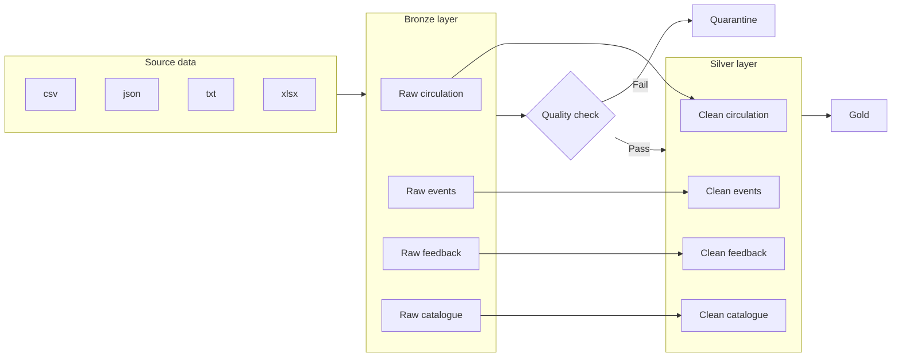
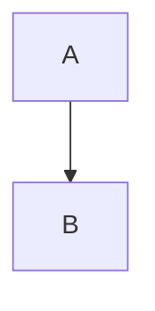

# Pipeline Architecture Diagram

```mermaid
flowchart LR

  Raw[Source data] --> Bronze[Bronze]
    Bronze --> Check{Quality check}
    Check -->|Pass| Silver[Silver]
    Check -->|Fail| Quarantine[Quarantine]
    Silver --> Gold[Gold]

  subgraph Raw["Source data"]
        csvCirculation[csv]
        jsonEvents[json]
        txtFeedback[txt]
        xlsxCatalogue[xlsx]
    end

    subgraph Bronze["Bronze layer"]
        RawCirculation[Raw circulation]
        RawEvents[Raw events]
        RawFeedback[Raw feedback]
        RawCatalogue[Raw catalogue]
    end

    subgraph Silver["Silver layer"]
        CleanCirculation[Clean circulation]
        CleanEvents[Clean events]
        CleanFeedback[Clean feedback]
        CleanCatalogue[Clean catalogue]
    end

    RawCirculation --> CleanCirculation
    RawEvents --> CleanEvents
    RawFeedback --> CleanFeedback
    RawCatalogue --> CleanCatalogue
```

```mermaid
flowchart TD
    A --> B
```
